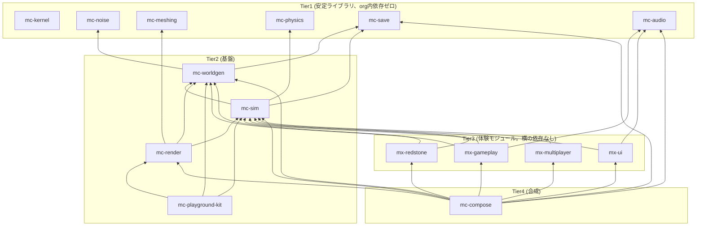

# nerima-games 依存関係ポリシー

nerima-games org 16 リポジトリ(`mc-audio` `mc-compose` `mc-dev-meta` `mc-kernel` `mc-meshing`
`mc-noise` `mc-physics` `mc-playground-kit` `mc-render` `mc-save` `mc-sim` `mc-worldgen`
`mx-gameplay` `mx-multiplayer` `mx-redstone` `mx-ui`)が守るべき、リポジトリ間 (`@nerima-games/*`)
依存の許可グラフと、その実効(enforcement)機構を定めた文書です。

**役割分担**: どのリポジトリがどの Tier に属するか、Tier とディレクトリ構成(`src/application/` の
有無など)がどう(無)関係かは [PACKAGE_STANDARD.md「4層の依存アーキテクチャ」](PACKAGE_STANDARD.md#4層の依存アーキテクチャ)
および [GLOSSARY.md「Tier1〜Tier4 と「層外」」](GLOSSARY.md#tier1tier4-と層外)が定義の正典です。
本書はその上に立って、**エッジ単位の許可グラフ**(誰が誰に依存してよいか)、**実効機構**
(`oxlint` の `no-restricted-imports`)、`mc-playground-kit` の devDependency-only 例外の理由、
そして新しい依存を追加する手順を定めます。バージョン伝播の順序は
[RELEASE_STANDARD.md §5](RELEASE_STANDARD.md)、自己レビューのチェック項目は
[REVIEW_STANDARD.md](REVIEW_STANDARD.md) を参照してください(重複させません)。

調査日は 2026-08-01。根拠は各リポジトリの `package.json`(16リポジトリ全件)と、org 標準の
移行前テンプレートである `scripts/check-dependency-whitelist.ts` の `REPOSITORY_POLICY`
定数(16リポジトリに byte-for-byte コピーされている想定のもの。実際に `mc-worldgen` 版全文と、
他15リポジトリの当該定数の抜粋を読んで確認)を実際に読んで得ています。

## 決定事項の一覧

| 分類 | 決定 | 根拠 |
|---|---|---|
| 依存の向き | Tier N は Tier <N のみに依存可。同一 Tier 内の横の依存、上位 Tier への逆流、循環はすべて禁止 | `mc-worldgen/scripts/check-dependency-whitelist.ts:19-27` |
| `mc-kernel` | 全リポジトリから暗黙に import 可。どの許可リストにも書かない(書くとエラー) | 同 `:29-32`, `:670-677` |
| `mc-playground-kit` | 他リポジトリからは `devDependencies` としてのみ参照可。`dependencies` に置くこと・出荷コードからの import は禁止 | 同 `:39-41`, `:205-215` |
| 実効機構 | 旧 `scripts/check-dependency-whitelist.ts` + `test/` + `pnpm check:deps` を廃止し、各リポジトリ `oxlint.json` の `no-restricted-imports` に一本化する。`pnpm lint` が旧 `check:deps` の役割を吸収する | 本書 §5、[PACKAGE_STANDARD.md「`scripts/check-dependency-whitelist.ts` の廃止」](PACKAGE_STANDARD.md#scriptscheck-dependency-whitelistts-の廃止) |
| `oxlint.json` の一致性 | 実効機構(oxlint)は全リポジトリ共通だが、`oxlint.json` の `no-restricted-imports` の中身は Tier ごと・リポジトリごとに異なってよい。byte-identical は適合条件ではない | 本書 §5 |
| 現状の乖離 | `mc-worldgen` `mx-redstone` `mx-ui` `mx-multiplayer` の `package.json#dependencies` は宣言された依存グラフに追いついておらず、移行対象。`mc-sim` `mc-render` `mc-playground-kit` にも追加の乖離を発見(本書 §4) | 本書 §4、`MIGRATION_RUNBOOK.md`(別途) |
| 新規依存の提案手順 | 消費側リポジトリの PR で `oxlint.json` + 本書を同時に更新し、`REVIEW_STANDARD.md` に沿って自己レビューする | 本書 §6 |

## 1. 4層の依存グラフ(エッジレベル)

`mc-worldgen/scripts/check-dependency-whitelist.ts:132-191` の `REPOSITORY_POLICY.dependencyGraph`
(16リポジトリの完全なロースター。cycle 検出のために他リポジトリの行もミラーして持つ設計)から、
実際に許可されているエッジを抜き出したものです。`mc-kernel` へのエッジはどの行にも現れません
(ルール4、下記)。

| リポジトリ | Tier | 許可された依存先(`@nerima-games/*`。`mc-kernel` は別枠で常に可) |
|---|---|---|
| `mc-kernel` | 1 | (なし) |
| `mc-noise` | 1 | (なし) |
| `mc-meshing` | 1 | (なし) |
| `mc-physics` | 1 | (なし) |
| `mc-save` | 1 | (なし) |
| `mc-audio` | 1 | (なし) |
| `mc-worldgen` | 2 | `mc-noise`, `mc-save` |
| `mc-sim` | 2 | `mc-physics`, `mc-save`, `mc-worldgen` |
| `mc-render` | 2 | `mc-meshing`, `mc-sim`, `mc-worldgen` |
| `mc-playground-kit` | 2 | `mc-worldgen`, `mc-sim`, `mc-render`(自身の実行時依存。他リポジトリからの devDependency-only 制約とは別、§3参照) |
| `mx-gameplay` | 3 | `mc-sim`, `mc-worldgen`, `mc-audio` |
| `mx-redstone` | 3 | `mc-sim`, `mc-worldgen` |
| `mx-ui` | 3 | `mc-sim`, `mc-audio` |
| `mx-multiplayer` | 3 | `mc-sim` |
| `mc-compose` | 4 | `mc-audio`, `mc-render`, `mc-save`, `mc-sim`, `mc-worldgen`, `mx-gameplay`, `mx-redstone`, `mx-ui`, `mx-multiplayer` |
| `mc-dev-meta` | 層外 | (なし。グラフの外。他リポジトリを `git clone` するだけで依存エッジは持たない) |



図に描いていない前提が2つあります。

- **`mc-kernel` は上記16ノードすべてから暗黙に import 可能**です(下記ルール4)。描くと図が
  16本の矢印で埋まるため省略しています。
- **`mc-dev-meta` はこの図に存在しません。** 依存グラフの外側にある pnpm workspace の
  開発ツール束ね役で、他15リポジトリを `git clone` して束ねるだけです
  (`mc-dev-meta/package.json` の `description`、および `scripts/sync-repos.ts` 系のスクリプト)。

## 2. 依存方向の規則

`mc-worldgen/scripts/check-dependency-whitelist.ts` のヘッダコメント(ルール1〜4、全16リポジトリに
byte-for-byte 複製される設計)がそのまま本org の規則です。

1. **Tier N は Tier <N にのみ依存できる。** 上位 Tier への依存(逆流)は許可グラフに存在せず、
   `checkDeclaredDependencies`(同ファイル `:797-844`)が `package.json` レベルで、
   `classifyImport`(`:710-788`)が import 文レベルで機械的に弾きます。
2. **Tier3 の4リポジトリ間には横の依存を作らない。** `mx-gameplay` `mx-redstone` `mx-ui`
   `mx-multiplayer` はどの行を見ても互いを参照しません(上表)。これらは Tier2 (`mc-sim` /
   `mc-worldgen` / `mc-audio`)を経由してのみ会話します(`mc-worldgen/scripts/
   check-dependency-whitelist.ts:158-160` のコメント「There is deliberately no edge between
   any two of these rows」)。
3. **循環は一切許可しない。** 参考にした先行実装(reference implementation)は「co-evolution
   pairs」として6つの循環を許可リストで正当化していましたが、この org ではその許可リストを
   採用せず、`findCycles`(同 `:605-643`)がグラフ中のあらゆる循環をハード失敗として検出します
   (同 `:19-21`)。循環になりそうな共通ロジックが見つかった場合の対処は、循環を検出した際の
   エラーメッセージが明記する通り「共通の語彙を `@nerima-games/mc-kernel` に抽出する」ことです
   (同 `:621`)。
4. **推移閉包は権利を与えない。** `A` が `B` に依存し、`B` が `C` に依存していても、`A` は `C`
   を import してよいことにはなりません(同 `:23-27`)。16リポジトリ分割が実質1つのモノリスに
   戻ることを防ぐための規則で、`findTransitivePath`(`:574-600`)が違反を「到達可能だが推移的」
   として区別して報告します。
5. **`mc-kernel` のみ例外的に全リポジトリから暗黙に import 可能。** どのリポジトリの許可リストにも
   `@nerima-games/mc-kernel` を明示してはならず(`checkPolicyConfiguration` がむしろこれを
   設定エラーとして検出します、同 `:670-677`)、それでいて `package.json#dependencies` への
   宣言は省略できません(同 `:29-32` ルール4、「universal importability is a policy exemption,
   not a packaging exemption」)。

## 3. `mc-playground-kit` の devDependency-only 例外

**誤解しやすい点を先に区別します。** `mc-playground-kit` 自身が `mc-worldgen` / `mc-sim` /
`mc-render` に依存すること(上表の Tier2 の行)は、ふつうの Tier2 → Tier1/Tier2 の実行時依存で、
例外ではありません。`mc-playground-kit/package.json` の `description` が
「Dev-only preview harness ... the glue that stands up a mini world + camera + renderer + input
in about a second」と説明する通り、プレビュー用ハーネスがワールド・シム・レンダラーを実際に
呼び出すために必要な、ふつうの実行時依存です。

**例外はその逆方向、つまり「他のリポジトリが `mc-playground-kit` に依存してよいか」です。**
`mc-worldgen/scripts/check-dependency-whitelist.ts:39-41`(ルール6)と `:205-215`
(`DEV_ONLY_PACKAGES`)が定める通り、`@nerima-games/mc-playground-kit` は:

- どのリポジトリの `package.json` でも `dependencies` に置いてはならず、`devDependencies` にのみ
  置ける。
- 出荷される `index.ts` / `domain/` / `application/` からの import は禁止で、`test/` や
  `scripts/` からの参照のみ許される。

理由は、devDependency はランタイム上のエッジを作らず、グラフのノード間関係として存在しないためです。
そのため `REPOSITORY_POLICY.dependencyGraph` 自体にも登場しません(コメント「`@nerima-games/mc-playground-kit` is absent from the rows of
`mx-gameplay` and `mx-redstone` ... a devDependency creates no runtime edge, and therefore no
graph edge」、`:126-130`)。

**なぜこの制約が必要か。** `mc-playground-kit` は開発時のプレビュー・デモ実行専用のハーネスで、
本番ビルドには含まれません。もし `mx-gameplay` のような Tier3 の体験モジュールが `mc-playground-kit`
を `dependencies`(実行時依存)として入力処理を頼ってしまうと、本番ビルドではその依存が
存在しない(あるいは配布物から除かれる)ため、**出荷されたゲームには入力処理が一切ない**
状態になります。`mc-worldgen/scripts/check-dependency-whitelist.ts:39-41` のコメントが
まさにこの帰結を「A runtime dependency on it would delete input handling from the shipped
game」と明記しています。

この org は実際にこの失敗モードを一度経験しています。同ファイル `:176-184` の
`mc-compose` の行に残るコメントによれば、垂直スライスの初期実装では、ロースターのどのリポジトリも
`mc-render` への実行時エッジを宣言していなかったため、**出荷ビルドに入力ステージがまったく
存在しない**という状態が発生しました(「the shipped build had no input stage at all」)。

これを解消した設計判断が、**本物の入力サービスを `mc-playground-kit`(dev-only)ではなく
`mc-render`(Tier2、常に本物の実行時依存)に置く**ことです。`mc-render/package.json` の
`description` が「Rendering and runtime input for the nerima-games Minecraft-clone rebuild:
... and the InputService」と明記する通り、`InputService` は `mc-render` が提供する実行時サービスの
1つであり、`mc-compose`(Tier4)は `mc-render` への実行時エッジを持つため
(上表、および同 `:169-186` の `mc-compose` 行)、`mc-render` が登録する
`input` / `camera-mirror` / `chunk-sync` / `draw` / `post-fx` の各ステージ(同コメント)が
出荷ビルドに確実に含まれます。`mc-playground-kit` はあくまで開発時に同じ構成要素を素早く
立ち上げるためのハーネスであり、本番の入力経路そのものではありません。

**したがって、新しい Tier3 モジュールが「プレビュー用に速く手元で動かしたい」という理由で
`mc-playground-kit` への依存を求める場合、それは常に `devDependencies` に限定し、
出荷コードが実際に必要とする入力・レンダリング機能は `mc-render` から得るべきです。**
`mc-playground-kit` への実行時依存を提案する PR は、この理由により却下されます。

## 4. 宣言された依存グラフ vs 観測された依存グラフ(現状の検証結果)

[GLOSSARY.md「「宣言された」依存グラフ vs 「観測された」依存グラフ」](GLOSSARY.md#宣言された依存グラフ-vs-観測された依存グラフ)
が定める区別に従い、§1 の表(宣言)と、実際に全16リポジトリの `package.json#dependencies` を
読んで得た内容(観測)を突き合わせました。

| リポジトリ | 宣言された許可先 | 観測された `dependencies`(`@nerima-games/*` のみ、`effect` 等は省略) | 状態 |
|---|---|---|---|
| `mc-kernel` `mc-noise` `mc-meshing` `mc-physics` `mc-save` `mc-audio` | (なし) | (なし) | 一致 |
| `mc-worldgen` | `mc-noise`, `mc-save` | (なし) | **MIGRATION対象**。`package.json#dependencies` は `effect` のみ |
| `mx-redstone` | `mc-sim`, `mc-worldgen` | (なし) | **MIGRATION対象**。同上 |
| `mx-ui` | `mc-sim`, `mc-audio` | (なし) | **MIGRATION対象**。同上 |
| `mx-multiplayer` | `mc-sim` | (なし) | **MIGRATION対象**。同上 |
| `mc-sim` | `mc-physics`, `mc-save`, `mc-worldgen` | `mc-kernel`(universal枠), `mc-physics` | **要確認**。`mc-save` と `mc-worldgen` が `dependencies` に見当たらない |
| `mc-render` | `mc-meshing`, `mc-sim`, `mc-worldgen` | `mc-kernel`(universal枠), `mc-meshing`, `mc-worldgen` | **要確認**。`mc-sim` が `dependencies` に見当たらない |
| `mc-playground-kit` | `mc-worldgen`, `mc-sim`, `mc-render` | (なし) | **要確認**。3つとも `dependencies` に見当たらない |
| `mx-gameplay` | `mc-sim`, `mc-worldgen`, `mc-audio` | `mc-kernel`(universal枠), `mc-sim`, `mc-worldgen` | **要確認**。`mc-audio` が `dependencies` に見当たらない |
| `mc-compose` | 上表9件 | 上表9件 + `mc-kernel`(universal枠) | 一致 |
| `mc-dev-meta` | (層外) | (なし) | 一致 |

**`mc-worldgen` / `mx-redstone` / `mx-ui` / `mx-multiplayer` の4リポジトリ**は、このセッションで
既に移行対象として特定済みで、修正手順は `MIGRATION_RUNBOOK.md`(別途、本 `.github` リポジトリでは
なく移行作業側に記述)が扱います。本書はグラフの正典としてこれを参照するのみで、移行手順を
重複させません。

**`mc-sim` / `mc-render` / `mc-playground-kit` / `mx-gameplay` の4リポジトリ**については、本書の
執筆にあたって独自に `package.json` を読んで検証した結果、上記4リポジトリとは別に、宣言された
グラフとの間に追加の乖離を発見しました。これは今回の調査依頼が明示した「既知のドリフト」
(`mc-worldgen` `mx-redstone` `mx-ui` `mx-multiplayer` の4件)には含まれていなかったものです。
`mc-sim` は `mc-kernel` と `mc-physics` のみを宣言しており `mc-save` / `mc-worldgen` への
実行時依存を欠き、`mc-render` は `mc-kernel` `mc-meshing` `mc-worldgen` のみで `mc-sim` への
実行時依存を欠き、`mc-playground-kit` はTier2の自分の行が要求する3依存(`mc-worldgen` `mc-sim`
`mc-render`)をいずれも欠き、`mx-gameplay` は `mc-audio` への依存を欠きます。
これらが「意図的なアーキテクチャ変更(まだ許可グラフ側に反映していないだけ)」なのか
「未修正のドリフト」なのかは本書の調査だけでは判断できないため、**MIGRATION対象と断定せず
「要確認」として記録します。** `MIGRATION_RUNBOOK.md` の対象範囲をこの4リポジトリまで広げるか、
別issueとして追跡するかは、次にこの文書または runbook を編集する際に判断してください。

## 5. 実効機構: `oxlint` の `no-restricted-imports`

### 何が変わったか

これまでは `scripts/check-dependency-whitelist.ts` + `test/check-dependency-whitelist.test.ts`
+ `package.json` の `check:deps` スクリプトという組が、全16リポジトリに逐語的に複製されて
実効機構を担っていました(このファイル自体が「TEMPLATE for all 16 repositories」と自称する通り、
`mc-worldgen/scripts/check-dependency-whitelist.ts:4-8`)。

**この組は org 標準から廃止します。** 代替は oxlint 組み込みの `no-restricted-imports` ルールで、
パターン/正規表現ベースでモジュール群を制限できます(oxc 公式ドキュメント
`https://oxc.rs/docs/guide/usage/linter/rules/eslint/no-restricted-imports` で確認済み。
`patterns` オプションの `regex` / `group` によるモジュール群指定、`paths` オプションによる
単一モジュール指定の両方をサポートします)。各リポジトリの `oxlint.json` が、**自分自身の Tier
に基づいて自分自身の禁止パターンを宣言する**構成に変わり、`pnpm lint` が旧 `pnpm check:deps` の
役割を吸収します。廃止の経緯と `api-lock.md` 側の並行した廃止は
[PACKAGE_STANDARD.md「`scripts/check-dependency-whitelist.ts` の廃止」](PACKAGE_STANDARD.md#scriptscheck-dependency-whitelistts-の廃止)
にも記載があるため、本書では重複説明を避け、実効機構の詳細と Tier ごとの設定例のみを示します。

**`oxlint.json` は byte-identical でなくなります。これは意図した trade-off です。** 実効機構
(oxlint という「仕組み」)は全リポジトリ共通ですが、`no-restricted-imports` の中身(何を禁止
するか)はリポジトリごとの許可グラフの行が異なる以上、必然的に異なります。以前の
`check-dependency-whitelist.ts` は逐語的コピーの中で `REPOSITORY_POLICY` という1つの定数だけを
差し替える設計でしたが、`oxlint.json` は最初からファイル全体がリポジトリ固有の設定ファイルで
あり、「1つの定数以外は共通」という制約を維持する理由がありません。**許可グラフのロジックを
16リポジトリで単一の情報源に集約すること自体は今回検討しましたが、明示的に見送りました。**
各リポジトリの `oxlint.json` は今まで通り、そのリポジトリの実装者(または担当エージェント)が
独立に保守します。

なお `check-dependency-whitelist.ts` が担っていたチェックのうち、`no-restricted-imports` で
表現できないもの(例: 生の時刻取得 `Date.now()` の禁止、`package.json` の `dependencies` と
実際の import の一致検証)を今後どう扱うかは、各リポジトリの裁量です。org 標準として個別の
代替スクリプトを要求しません(`PACKAGE_STANDARD.md` 同節を参照)。

### Tier ごとの設定例

以下はいずれも実在する許可グラフの行(§1)に基づく例です。`"warn"` は既存の `oxlint.json` の
慣行(`mc-kernel/oxlint.json:119-126` の `no-restricted-imports` エントリなど)に合わせています。
`"error"` に変える判断はリポジトリごとの裁量です。

**Tier1(例: `mc-physics`。org内依存ゼロ)**

```jsonc
// mc-physics/oxlint.json
"no-restricted-imports": ["warn", {
  "patterns": [{
    "regex": "^@nerima-games/(?!mc-kernel\\b).+",
    "message": "mc-physics is a Tier1 library (DEPENDENCY_POLICY.md) and must not depend on any other @nerima-games/* package. mc-kernel is universally importable and exempt."
  }]
}]
```

**Tier2(例: `mc-worldgen`。許可先は `mc-noise`, `mc-save`)**

```jsonc
// mc-worldgen/oxlint.json
"no-restricted-imports": ["warn", {
  "patterns": [{
    "regex": "^@nerima-games/(mc-meshing|mc-physics|mc-audio|mc-sim|mc-render|mc-playground-kit|mx-gameplay|mx-redstone|mx-ui|mx-multiplayer|mc-compose|mc-dev-meta)(/.*)?$",
    "message": "mc-worldgen (Tier2, DEPENDENCY_POLICY.md) may depend only on mc-noise, mc-save, and mc-kernel. Propose a graph change before adding this import."
  }]
}]
```

**Tier3(例: `mx-ui`。許可先は `mc-sim`, `mc-audio`。横の `mx-*` 依存は禁止)**

```jsonc
// mx-ui/oxlint.json
"no-restricted-imports": ["warn", {
  "patterns": [
    {
      "regex": "^@nerima-games/(mx-gameplay|mx-redstone|mx-multiplayer)(/.*)?$",
      "message": "Tier3 experience modules do not depend on each other laterally (DEPENDENCY_POLICY.md §2). Talk through mc-sim or mc-worldgen instead."
    },
    {
      "regex": "^@nerima-games/(mc-worldgen|mc-render|mc-meshing|mc-noise|mc-physics|mc-save|mc-playground-kit|mc-compose)(/.*)?$",
      "message": "mx-ui (Tier3, DEPENDENCY_POLICY.md) may depend only on mc-sim, mc-audio, and mc-kernel."
    }
  ]
}]
```

**Tier4(例: `mc-compose`。9件の許可先 + `mc-kernel`。`mc-playground-kit` は禁止、Tier1兄弟は推移的にのみ到達可能で直接importは不可)**

```jsonc
// mc-compose/oxlint.json
"no-restricted-imports": ["warn", {
  "patterns": [
    {
      "regex": "^@nerima-games/mc-playground-kit(/.*)?$",
      "message": "mc-playground-kit is devDependency-only (DEPENDENCY_POLICY.md §3); it must never be imported from shipped composition code."
    },
    {
      "regex": "^@nerima-games/(mc-noise|mc-meshing|mc-physics)(/.*)?$",
      "message": "mc-compose reaches these only transitively through mc-worldgen/mc-sim/mc-render. Reaching through a dependency is not an import licence (DEPENDENCY_POLICY.md §2, no-transitive-closure)."
    }
  ]
}]
```

## 6. 新しいクロスリポジトリ依存を提案する手順

1. **まず Tier 規則(§2)に照らして提案可能か確認する。** Tier を逆流する依存や、Tier3内の横の
   依存、循環を作る依存は、そのままでは提案できません。共通ロジックが必要なら
   `@nerima-games/mc-kernel` への抽出を検討してください(§2 ルール3)。
2. **消費側リポジトリで1つの PR を作る。** 対象は次の2ファイルです。
   - 消費側リポジトリの `oxlint.json` — 新しい依存先を `no-restricted-imports` の禁止パターンから
     除外する(許可する)ように書き換える。
   - この `DEPENDENCY_POLICY.md`(本リポジトリ `.github`)— §1 の表と mermaid 図に新しいエッジを
     追加する。
   `package.json#dependencies`(または devDependency-only 対象なら `devDependencies`)への
   実際の追加も同じ PR に含めます。
3. **`REVIEW_STANDARD.md` に沿って自己レビューする。** この org は単独メンテナ + AI エージェント
   体制のため、チームレビューではなく自己レビュー・自己マージが通常運用です。
   `REVIEW_STANDARD.md` のチェック項目「新しく `@nerima-games/*` の import を追加したなら、
   `DEPENDENCY_POLICY.md` を確認したか」に沿い、`no-restricted-imports` が機械的に弾かない
   ケース(Tier 逆流や横の依存が正規表現の書き漏れですり抜ける場合など)がないか、本書の
   判断基準と手動で突き合わせてください。`PULL_REQUEST_TEMPLATE.md` のチェックリストにも
   同項目があります。
4. **`pnpm verify`(`pnpm lint` を含む)がローカルで通ることを確認する。** 新しい
   `no-restricted-imports` パターンが既存の import に誤って抵触していないかは、これで検証します。
   旧 `pnpm check:deps` に相当する専用コマンドはもう存在しません(§5)。

## 適用範囲外

- **ディレクトリ構成・`package.json` の必須フィールド**: [PACKAGE_STANDARD.md](PACKAGE_STANDARD.md)。
- **リリースバージョンの伝播順序**: [RELEASE_STANDARD.md](RELEASE_STANDARD.md)。本書は「誰が誰に
  依存してよいか」だけを扱い、「その依存の新バージョンをいつ取り込むか」は扱いません。
- **外部(npm)パッケージの許可判断**: 本書は `@nerima-games/*` 間の依存グラフに焦点を当てており、
  `effect` のような外部パッケージの追加可否についての詳細な基準は今後の課題です。追加した依存の
  固定・検知(サプライチェーン上の扱い)は [SUPPLY_CHAIN.md](SUPPLY_CHAIN.md) を参照してください。
- **自己レビュー・自己マージの具体的な手続き**: [REVIEW_STANDARD.md](REVIEW_STANDARD.md)。
